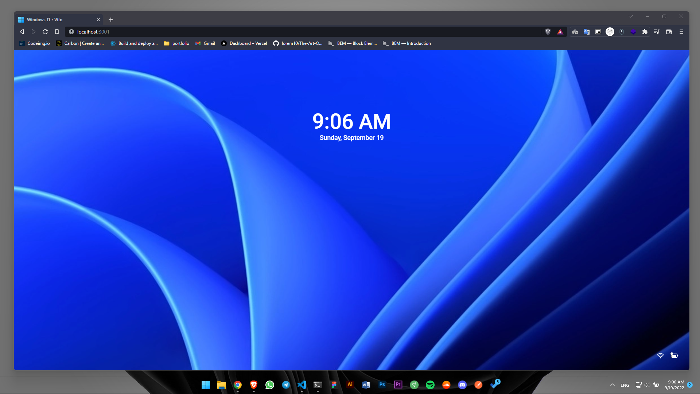

# Welcome to Wins-11 Simulator Web App 🪟



**Wins-11 Simulator** is a captivating web application that brings the nostalgic experience of the classic Windows 11 operating system right to your browser. With the power of modern web technologies like React.js and Redux, this simulator offers a seamless and interactive journey down memory lane. Whether you're feeling nostalgic or curious about the past, Wins-11 Simulator is here to take you on a visually appealing and functionally rich adventure.

## Table of Contents

- ✨ [Features](#-features)
- 📦 [Techs](#-techs)
- 🖥️ [Preview](#-preview)
- 📸 [Gallery](#-gallery)
- 🚀 [Demo](#-demo)
- 🔨 [Getting Started](#-getting-started)
  - 🔩 [Packages](#-packages) 
  - 📦 [Installation](#-installation)
- 🎮 [Usage](#-usage)
- 📺 [Support and Social Media](#-support-and-social-media)
- 🧑‍💻 [Developers](#-developers)
- 💡 [Wish List](#-wish-list)
- 📜 [License](#-license)

## ✨ Features

- Familiar Desktop Environment: Experience the iconic Windows 11 desktop, complete with a Start menu, taskbar, and daily usage apps.
- Web-Based: Access the simulator directly from your browser, without the need for any downloads or installations.
- Browsing: You literally can browse in your broswer.
- 🔄 Redux-powered State Management: Enjoy a smooth and responsive user interface with the help of Redux for efficient state management.
- Detail-oriented: In implementation, attention has been given to details.

## 📦 Techs

                   

## 🖥 Preview

Here's a sneak peek of what the Wins-11 Simulator looks like:


## 📸 Gallery 

For more pictures check out [Preview Gallery](gallery.md).

## 🚀 Demo

Check out the live demo of the Wins-11 Simulator [here](https://wins-11.ir).

## 🔨 Getting Started   

### 🔩 Packages

- react (18.2.0)
- react-redux (8.0.2)
- sass (1.23.7)
- @reduxjs/toolkit (1.8.2)

### 📩 Installation

1. Clone the repository:
```bash
git clone https://github.com/vito-mohagheghian/wins-11.git
```

2. Navigate to the project directory:
```bash
cd wins-11
```

3. Install dependencies:
```bash
npm install

# or 

yarn
```


## 🎮 Usage

1. Start the development server: `yarn start`
2. Open your browser and visit `http://localhost:3000` to access the simulator.

## 📺 Support and Social Media

- For support and inquiries, contact us at vito.mohagheghian@gmail.com.
- Follow us on [Twitter](https://x.com/hereisvito) for updates and news.
- For donations [Coffee be de ☕](https://www.coffeebede.com/vitomohagheghian)

## 🧑‍💻 Developers

- Vito Mohagheghian - [GitHub](https://github.com/vito-mohagheghian) - [LinkedIn](https://www.linkedin.com/in/vito-mohagheghian) - [X](https://x.com/hereisvito)

## 💡 Wish List

Help us make Wins-11 Simulator even better! Check out our [Wish List](wishlist.md) to see upcoming features and improvements.

> it's in progress

## 📜 License

This project is licensed under the [MIT License](LICENSE).

---
<p align=center>
I embarked on coding this project for the sheer joy of it and the opportunity to learn new things. Engaging in such projects exposes me to numerous challenges that ultimately enhance my skills.
</p>
